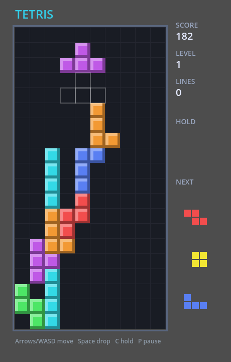

# Tetris (Godot 4)

A classic Tetris game built with the **Godot 4.3 game engine** and exported to **HTML5**.



## Features

- All 7 tetrominoes with 7-bag random shuffle
- Rotation with wall-kick
- Ghost piece showing where the piece will land
- **HOLD** and **NEXT** (3 upcoming pieces)
- Soft drop / hard drop
- Scoring with level progression and line clears (100/300/500/800 × level)
- Pause (P) and restart (R)
- Game-over screen

## Controls

| Action       | Keys                          |
|--------------|-------------------------------|
| Move left    | `←` / `A`                     |
| Move right   | `→` / `D`                     |
| Soft drop    | `↓` / `S`                     |
| Hard drop    | `Space`                       |
| Rotate CW    | `↑` / `W` / `X`               |
| Rotate CCW   | `Z`                           |
| Hold         | `C` / `Shift`                 |
| Pause        | `P`                           |
| Restart      | `R` / `Enter` (on game over)  |

## Running

### Desktop (Godot editor)
Open the project in Godot 4.3 (`project.godot`) and press **F5** (`scenes/main.tscn` is the main scene).

### HTML5 build
The repository contains the export preset (`export_presets.cfg`, "Web" preset).

```bash
# From the project root, regenerate the web build:
godot --headless --export-release "Web" build/web/index.html --path .

# Serve it locally:
cd build/web && python3 -m http.server 8000
# then open http://localhost:8000/
```

## Testing

The project includes a headless gameplay test:

```bash
godot --headless res://tests/game_test.tscn --path .
```

It drives the real scene through the input path and asserts spawn, movement,
rotation, hold, hard-drop scoring, gravity stacking, and line-clearing
(9 checks).

## Project structure

```
project.godot          # engine config, viewport 460x720
export_presets.cfg     # "Web" HTML5 export preset
scenes/main.tscn       # main scene (Node2D + main.gd)
scripts/main.gd        # all game logic + rendering (_draw)
tests/                 # headless gameplay test + demo scene
```